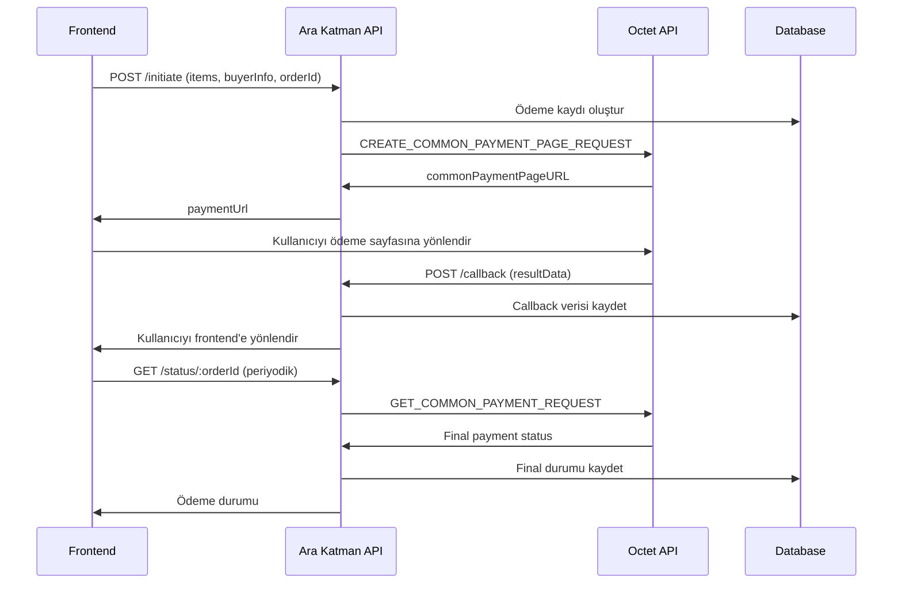
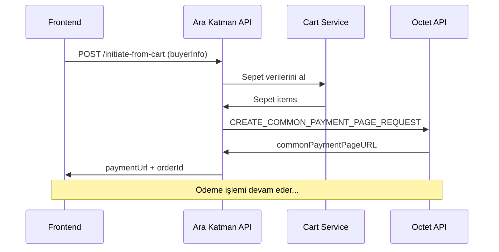

# Octet Ödeme Ara Katman Servisi - API Dokümantasyonu

## Proje Özeti

Bu doküman, Pasha Backend sisteminin Octet Ortak Ödeme Sayfası API'si ile entegrasyonu için geliştirilmiş ara katman (middleware) servisinin API dokümantasyonunu içerir.

### Amaç
- Frontend'in doğrudan Octet API'si ile iletişim kurmasını engellemek
- secretKey ve diğer hassas bilgileri güvenli bir şekilde backend'de saklamak
- Başarılı ve başarısız ödeme senaryolarını yönetmek
- Frontend geliştirme sürecini basitleştirmek

### Güvenlik Özellikleri
- ✅ secretKey backend'de gizli tutulur
- ✅ Hash hesaplaması sunucu tarafında yapılır
- ✅ Sunucudan sunucuya doğrulama (S2S)
- ✅ JWT authentication ile korumalı endpoint'ler

---

## Konfigürasyon

### Çevre Değişkenleri (.env)

```env
# Octet Ödeme API Konfigürasyonu
OCTET_API_URL="https://test-api.octet.com.tr/commonPaymentPage"
OCTET_PARTNER_CODE="YOUR_OCTET_PARTNER_CODE"
OCTET_SECRET_KEY="YOUR_OCTET_SECRET_KEY"

# Frontend URL (callback için)
FRONTEND_URL="http://localhost:3000"
PUBLIC_URL="http://localhost:3001"
```

### Test vs Production URL'leri

**Test Ortamı:**
```
OCTET_API_URL="https://test-api.octet.com.tr/commonPaymentPage"
```

**Production Ortamı:**
```
OCTET_API_URL="https://api.octet.com.tr/commonPaymentPage"
```

---

## API Endpoint'leri

### Base URL
- **Local**: `http://localhost:3001/api/v1/payment`
- **Production**: `https://your-domain.com/api/v1/payment`

### 1. Ödeme Başlatma

**Endpoint**: `POST /api/v1/payment/initiate`  
**Auth**: Gerekli (JWT Token)

#### Request Body
```json
{
  "items": [
    {
      "name": "Ürün A",
      "price": 150.75,
      "quantity": 1
    },
    {
      "name": "Ürün B", 
      "price": 50.00,
      "quantity": 2
    }
  ],
  "buyerInfo": {
    "name": "Ahmet",
    "surname": "Yılmaz",
    "email": "ahmet.yilmaz@example.com",
    "phone": "00905551234567",
    "tckn": "12345678901"
  },
  "orderId": "SIPARIS-12345"
}
```

#### Başarılı Response (200 OK)
```json
{
  "success": true,
  "paymentUrl": "https://test-api.octet.com.tr/commonPaymentPage?token=abc123...",
  "message": "Ödeme sayfası başarıyla oluşturuldu"
}
```

#### Hata Response (400 Bad Request)
```json
{
  "success": false,
  "message": "Eksik parametreler. items, buyerInfo ve orderId gerekli.",
  "error": "Missing required fields"
}
```

---

### 2. Sepetten Ödeme Başlatma

**Endpoint**: `POST /api/v1/payment/initiate-from-cart`  
**Auth**: Gerekli (JWT Token)

#### Request Body
```json
{
  "buyerInfo": {
    "name": "Ahmet",
    "surname": "Yılmaz",
    "email": "ahmet.yilmaz@example.com",
    "phone": "00905551234567",
    "tckn": "12345678901"
  }
}
```

#### Başarılı Response (200 OK)
```json
{
  "success": true,
  "paymentUrl": "https://test-api.octet.com.tr/commonPaymentPage?token=abc123...",
  "orderId": "ORDER-1738091234567-ab1c2d3e",
  "message": "Ödeme sayfası başarıyla oluşturuldu"
}
```

---

### 3. Ödeme Callback (Octet'ten gelen)

**Endpoint**: `POST /api/v1/payment/callback`  
**Auth**: Gerekli değil (Octet'ten gelen istek)

Bu endpoint Octet tarafından otomatik olarak çağrılır. Kullanıcı ödeme işlemini tamamladığında:

1. Octet bu endpoint'e callback gönderir
2. Callback verisi veritabanına kaydedilir
3. Kullanıcı frontend'e yönlendirilir: `${FRONTEND_URL}/odeme-sonuc?orderId=${originalOrderId}`

#### Octet'ten Gelen Veriler
```json
{
  "resultStatus": "SUCCESS",
  "resultData": "...",
  "apiReferenceID": "SIPARIS-12345-1738091234567",
  "amount": "250.75",
  "currency": "TL"
}
```

#### Yanıt
```http
HTTP/1.1 302 Found
Location: http://localhost:3000/odeme-sonuc?orderId=SIPARIS-12345
```

---

### 4. Ödeme Durumu Sorgulama

**Endpoint**: `GET /api/v1/payment/status/:orderId`  
**Auth**: Gerekli (JWT Token)

#### URL Parametreleri
- `orderId`: Sipariş ID'si (örn: "SIPARIS-12345")

#### Başarılı Response (200 OK)
```json
{
  "success": true,
  "data": {
    "orderId": "SIPARIS-12345",
    "status": "SUCCESS",
    "message": "Ödeme başarıyla doğrulandı",
    "paymentDetails": {
      "resultStatus": "SUCCESS",
      "amount": "250.75",
      "currency": "TL",
      "transactionId": "TXN123456789"
    }
  }
}
```

#### Status Değerleri
- **SUCCESS**: Ödeme başarıyla tamamlandı
- **ERROR**: Ödeme başarısız
- **PENDING**: Ödeme beklemede (henüz sonuçlanmadı)

---

## Kullanıcı Akışı

### 1. Normal Ödeme Akışı



### 2. Sepetten Ödeme Akışı



---

## Hata Kodları

| HTTP Status | Açıklama | Örnek Durum |
|-------------|----------|-------------|
| **200** | Başarılı işlem | Ödeme başlatıldı, durum sorgulandı |
| **400** | Geçersiz istek | Eksik parametreler, geçersiz veri |
| **401** | Kimlik doğrulama gerekli | JWT token yok veya geçersiz |
| **404** | Bulunamadı | Geçersiz orderId |
| **500** | Sunucu hatası | API bağlantı sorunu, veritabanı hatası |

---

## Veritabanı Şeması

### Payment Modeli

```sql
CREATE TABLE "payments" (
  "id" TEXT PRIMARY KEY,
  "order_id" TEXT UNIQUE NOT NULL,
  "api_reference_id" TEXT UNIQUE NOT NULL,
  "total_amount" DECIMAL(12,2) NOT NULL,
  "status" TEXT NOT NULL DEFAULT 'INITIATED',
  "octet_response" JSONB,
  "callback_data" JSONB,
  "final_response" JSONB,
  "created_at" TIMESTAMP DEFAULT NOW(),
  "updated_at" TIMESTAMP DEFAULT NOW(),
  "callback_time" TIMESTAMP,
  "finalized_at" TIMESTAMP
);
```

### Payment Status Enum

```typescript
enum PaymentStatus {
  INITIATED         // Ödeme başlatıldı
  CALLBACK_RECEIVED // Callback alındı
  SUCCESS          // Ödeme başarılı
  ERROR            // Ödeme başarısız
  PENDING          // Beklemede
}
```

---

## Test Senaryoları

### 1. Başarılı Ödeme Testi

```bash
# 1. Ödeme başlat
curl -X POST "http://localhost:3001/api/v1/payment/initiate" \
  -H "Authorization: Bearer YOUR_JWT_TOKEN" \
  -H "Content-Type: application/json" \
  -d '{
    "items": [
      {"name": "Test Ürün", "price": 100.00, "quantity": 1}
    ],
    "buyerInfo": {
      "name": "Test",
      "surname": "User",
      "email": "test@example.com",
      "phone": "00905551234567",
      "tckn": "12345678901"
    },
    "orderId": "TEST-ORDER-123"
  }'

# Expected Response:
# {
#   "success": true,
#   "paymentUrl": "https://test-api.octet.com.tr/...",
#   "message": "Ödeme sayfası başarıyla oluşturuldu"
# }

# 2. Ödeme durumu sorgula
curl -X GET "http://localhost:3001/api/v1/payment/status/TEST-ORDER-123" \
  -H "Authorization: Bearer YOUR_JWT_TOKEN"
```

### 2. Sepetten Ödeme Testi

```bash
# Önce sepete ürün ekle
curl -X POST "http://localhost:3001/api/cart/add" \
  -H "Authorization: Bearer YOUR_JWT_TOKEN" \
  -H "Content-Type: application/json" \
  -d '{
    "product_id": "PRODUCT_ID",
    "quantity": 1,
    "unit_price": 150.75
  }'

# Sepetten ödeme başlat
curl -X POST "http://localhost:3001/api/v1/payment/initiate-from-cart" \
  -H "Authorization: Bearer YOUR_JWT_TOKEN" \
  -H "Content-Type: application/json" \
  -d '{
    "buyerInfo": {
      "name": "Test",
      "surname": "User", 
      "email": "test@example.com",
      "phone": "00905551234567",
      "tckn": "12345678901"
    }
  }'
```

---

## Güvenlik Notları

### 1. Hassas Bilgiler
- ❌ **secretKey** asla frontend'e gönderilmez
- ❌ **partnerCode** client-side'da kullanılmaz
- ✅ Tüm hassas işlemler backend'de yapılır

### 2. Hash Doğrulama
- Hash hesaplaması Octet dokümanına uygun yapılır
- Parametreler alfabetik sırada birleştirilir
- secretKey sonuna eklenerek SHA-256 hash alınır

### 3. Callback Güvenliği
- Callback endpoint'i public'tir (Octet erişimi için)
- Gelen veriler güvenilir kabul edilmez
- Asıl doğrulama GET_COMMON_PAYMENT_REQUEST ile yapılır

---

## Loglama

Sistem tüm kritik işlemleri loglar:

```typescript
// Örnek log çıktıları
🚀 Ödeme başlatılıyor: ORDER-123
📤 Octet API'ye gönderilecek parametreler: { ... }
📥 Octet API yanıtı: { commonPaymentPageURL: "..." }
💾 Ödeme kaydı başarıyla saklandı: ORDER-123
📞 Ödeme callback alındı: ORDER-123-1738091234567
🔄 Kullanıcı frontend'e yönlendiriliyor: http://localhost:3000/odeme-sonuc?orderId=ORDER-123
🔍 Ödeme durumu sorgulanıyor: ORDER-123
✅ Sipariş durumu güncellendi: ORDER-123 CONFIRMED
```

---

## Production Deployment

### 1. Çevre Değişkenleri
- Production Octet API URL'ini ayarla
- HTTPS callback URL'leri kullan
- Güvenli secretKey oluştur

### 2. SSL/TLS
- Callback endpoint'i HTTPS olmalı
- Octet API ile güvenli iletişim

### 3. İzleme
- Payment işlemlerini izle
- Başarısızlık oranlarını takip et
- Log analizi yap

---

## Troubleshooting

### Sık Karşılaşılan Hatalar

1. **"Octet API'den geçerli ödeme URL'i alınamadı"**
   - secretKey kontrolü
   - partnerCode doğruluğu
   - Hash hesaplama hatası

2. **"Ödeme kaydı bulunamadı"**
   - orderId formatı kontrolü
   - Veritabanı bağlantısı
   - Payment tablosu varlığı

3. **"Callback işleme hatası"**
   - Frontend URL konfigürasyonu
   - Redirect URL formatı

### Debug Yöntemleri

```bash
# 1. Veritabanı kontrolü
npx prisma studio

# 2. Log izleme
tail -f logs/payment.log

# 3. Network debugging
curl -v -X POST "..." # Verbose output
```

---

## Sonraki Geliştirmeler

### Öneriler

1. **Refund (İade) Sistemi**
   - Para iadesi endpoint'leri
   - Kısmi iade desteği

2. **Webhook Sistemi**
   - Ödeme durumu değişikliklerinde otomatik bildirim
   - Email/SMS entegrasyonu

3. **Dashboard**
   - Ödeme istatistikleri
   - Başarısızlık analizi

4. **Multi-Currency**
   - Farklı para birimleri
   - Kur çevrimi

---

**Doküman Versiyonu**: 1.0  
**Son Güncelleme**: 29 Ocak 2025  
**Hazırlayan**: Backend Development Team 